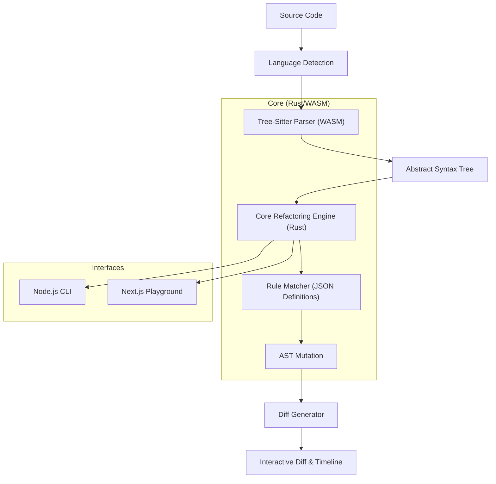

# LEXA — The Adaptive Code Refactor Engine


[](https://vercel.com/new/clone?repository-url=https%3A%2F%2Fgithub.com%2Frainel-projects%2Fopen-source-lexa&project-name=lexa-playground&repository-name=lexa-playground&root-directory=ui%2Fweb)


**LEXA** is a deterministic, educational refactoring engine designed to help developers write better code. It parses source code, applies strict refactoring rules, and produces detailed, interactive before-and-after diffs to explain the *why* behind every change.

> **Note:** This is NOT an AI rewriting tool. It is a precise, rule-based engine powered by Tree-Sitter and Rust.

## 🏗 Architecture Overview

Lexa operates as a hybrid architecture leveraging the performance of Rust and the portability of WebAssembly.



### Core Components
- **`core/engine`**: The brain of Lexa. Written in Rust, it handles the loading of rules and orchestration of the refactoring process.
- **`core/parsers`**: compiled Tree-Sitter grammars for supported languages (JS, TS, Python, Dart).
- **`ui/web`**: A modern Next.js + Monaco Editor playground for interactive demos.
- **`cli/lexacli`**: A globally installable generic CLI tool for local refactoring.

## 🚀 Getting Started

### Prerequisites
- **Rust**: `stable` toolchain
- **Node.js**: v18+
- **wasm-pack**: `cargo install wasm-pack`

### Installation
1. Clone the repository:
   ```bash
   git clone https://github.com/rainel-projects/open-source-lexa.git
   cd open-source-lexa
   ```

2. Build the Core (WASM):
   ```bash
   cd core
   wasm-pack build --target web
   ```

3. Run the Web UI:
   ```bash
   cd ui/web
   npm install
   npm run dev
   ```

## 🗺 Roadmap
- [ ] **MVP**: Support for JS, TS, Python, Dart. Basic "Nested If" rule.
- [ ] **Alpha**: Interactive Timeline in Web UI.
- [ ] **Beta**: CLI file system support (`lexa src/ --apply`).
- [ ] **v1.0**: Community rule plugin system.

## 🤝 Contributing
See [CONTRIBUTING.md](CONTRIBUTING.md) for details on how to add new rules or languages.

---
*Built with ❤️ by the Rainel Projects Team.*
